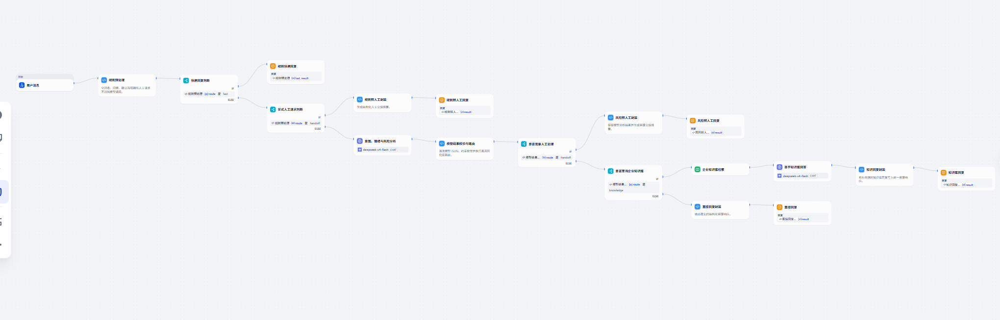
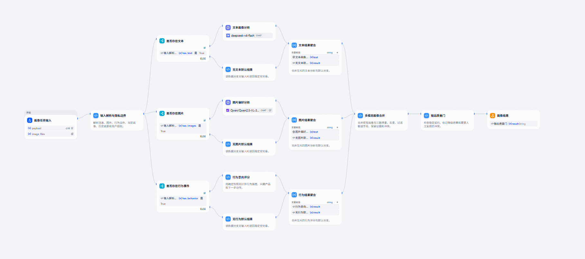

# Examples

These examples demonstrate larger graph patterns than the plugin-free templates in `assets/templates/`:

- `customer-service-chatflow.example.yml`: rule fast paths, model routing, human handoff, knowledge retrieval, and structured answers.
- `user-profile-workflow.example.yml`: parallel text, image, and behavior analysis with aggregation, consent handling, and a quality gate.

Both examples were generated by Codex from natural-language requirements after it loaded `$dify-workflow-dsl`. They were imported into Dify to verify their canvas structure. The public YAML copies are sanitized so they can be shared without private workspace bindings.

## Canvas previews

### Customer-service Chatflow

[Download YAML](customer-service-chatflow.example.yml)



### User-profile Workflow

[Download YAML](user-profile-workflow.example.yml)



They are sanitized reference exports. Before importing them into Dify:

1. Replace every value beginning with `REPLACE_WITH_`.
2. Select models installed in the target workspace.
3. Bind knowledge-retrieval nodes to a real dataset.
4. Export the app once from the target workspace and reconcile dynamic node fields.
5. Run strict validation, Dify preview, and representative smoke tests.

Find placeholders:

```bash
grep -R "REPLACE_WITH_" examples/*.yml
```

Validate structure:

```bash
python scripts/validate_dsl.py --strict examples/customer-service-chatflow.example.yml
python scripts/validate_dsl.py --strict examples/user-profile-workflow.example.yml
```
